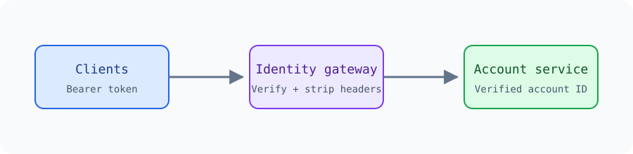

# API rollout handoff

The account service will move token validation behind the new identity gateway.
This bundle keeps the rollout decision, a runnable server example, and the
request path together.

## Handoff

- Read the [design notes](docs/design.md) before changing the gateway contract.
- Start from the [Go server example](examples/server.go) when wiring the health
  and account routes.
- Roll out to the canary pool, verify gateway failures stay below 0.1%, then
  continue one region at a time.

> [!CAUTION]
> Do not remove direct token validation until every production region reports
> the new gateway path for 24 hours.

## Exit checks

- [ ] Canary requests use the identity gateway.
- [ ] Invalid tokens still return `401` without reaching account handlers.
- [ ] Rollback restores direct validation within five minutes.
