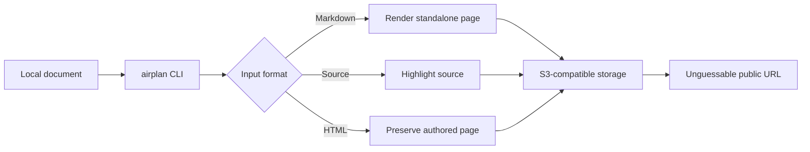

+++
title = "How airplan works"
project = "airplan"
audience = "Users and contributors"
+++

# How airplan works

Airplan turns a local Markdown document, HTML page, or source file into a
readable URL backed by storage you control. It has no hosted application,
account system, or background service.

> [!TIP]
> The shortest useful workflow is still `airplan plan.md`: one command in, one
> URL out.

## From local file to browser



The generated directory contains an ownership marker, the page, and—when the
input is Markdown or source—the original document. That marker lets airplan
inspect and safely delete exactly the objects it owns.

## Two ways to use it

:::: {.columns}
::: {.column}
### Command line

The CLI is optimized for people, scripts, and coding agents:

```sh
airplan plan.md
airplan --json report.md
airplan preview plan.md > plan.html
```

Successful uploads print only the final URL to stdout. Diagnostics stay on
stderr, so command substitution is safe.
:::
::: {.column}
### Go library

The same pipeline is available as an importable package:

```go
doc, err := airplan.RenderInput(ctx, input, opts)
if err != nil {
	return err
}
fmt.Printf("%s: %d bytes\n", doc.Title, len(doc.HTML))
```

The CLI contains no private rendering path; library callers get the same input
detection and standalone pages.
:::
::::

## A complete page in one object

Embedded assets
: Page CSS, interaction JavaScript, and syntax-highlighting styles are included
  directly in the generated HTML.

Conditional asset
: Mermaid is loaded only when the document contains an exact lowercase
  `mermaid` fence and external assets are allowed.

Original source
: Markdown and source uploads retain the authored bytes for source view, copy,
  download, and raw links.

| Input      | Page treatment                 | Original uploaded |
| ---------- | ------------------------------ | ----------------- |
| Markdown   | Rendered with navigation       | Yes, by default   |
| Source     | Syntax-highlighted, gist-like  | Yes, by default   |
| HTML       | Uploaded as authored           | No                |

## Storage configuration

Airplan accepts profiles for separate buckets or environments. A minimal
S3-compatible profile looks like this:

```toml
[profiles.demo]
endpoint = "https://example.r2.cloudflarestorage.com"
bucket = "airplan-demo"
public_base_url = "https://plans.example.com"
region = "auto"
access_key_id = "..."
secret_access_key = "..."
```

Credentials stay on the machine running airplan. Generated pages contain no
storage API credentials.

> [!IMPORTANT]
> An unguessable URL is not access control. Anyone who receives the URL can
> open it, and Markdown or HTML may contain active authored content. Upload only
> documents intended for every recipient of the link.

## Designed for agents

Airplan's output contract is intentionally narrow:

```text
success  -> URL on stdout, exit 0
warning  -> message on stderr, URL still on stdout
failure  -> error on stderr, no URL, non-zero exit
```

That makes the result easy to capture and return in chat without parsing logs.
The bundled
[agent skill](https://github.com/jimeh/airplan/blob/main/skills/airplan/SKILL.md)
teaches compatible coding agents when and how to upload a requested document.

## Where to learn more

- The
  [README](https://github.com/jimeh/airplan/blob/main/README.md)
  covers installation and everyday usage.
- The
  [behavior specification](https://github.com/jimeh/airplan/blob/main/SPEC.md)
  is the authoritative contract.
- The
  [implementation guide](https://github.com/jimeh/airplan/blob/main/IMPLEMENTATION.md)
  maps that contract onto the Go codebase.
- The
  [Go package reference](https://pkg.go.dev/github.com/jimeh/airplan/airplan)
  documents the importable API.[^package]

[^package]: The package and CLI share the same renderer, configuration model,
    and upload client.
