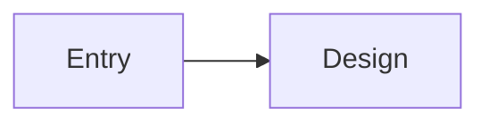

# Design notes

This page loads as its own document.

## Deep dive

```mermaid
flowchart LR
  Entry --> Design
```

Print detail

Printed bundle content

## Decisions

Use complete documents and ordinary links.
