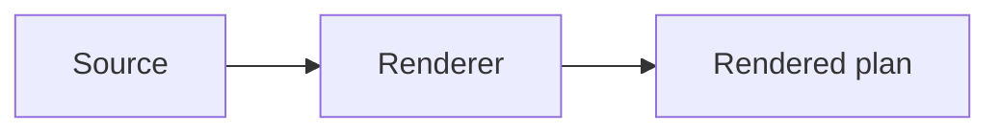
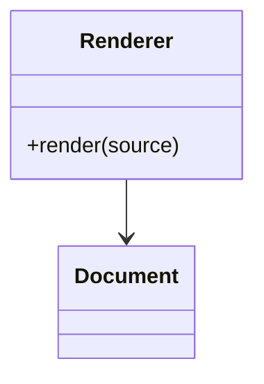
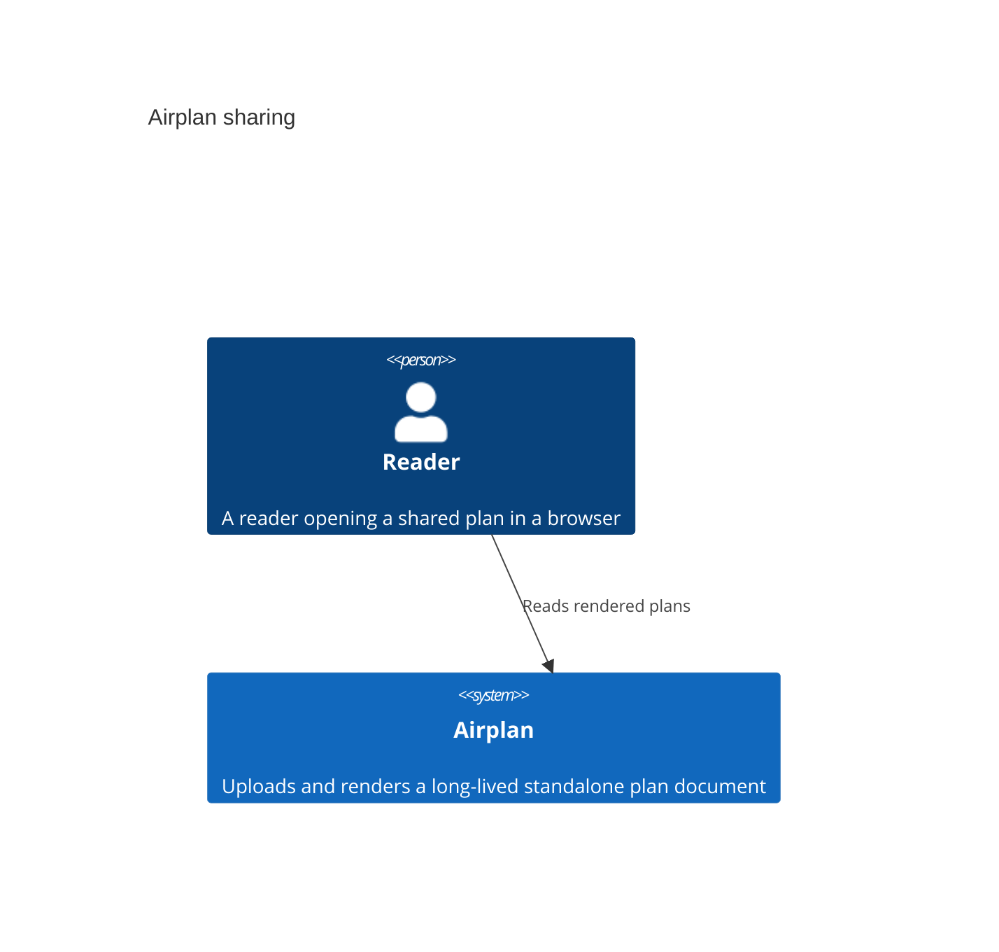

# Real Mermaid rendering

## Flowchart

```mermaid
flowchart LR
  Source --> Renderer --> Published[Rendered plan]
```

## Class diagram

```mermaid
classDiagram
  class Renderer {
    +render(source)
  }
  Renderer --> Document
```

## C4 diagram

```mermaid
C4Context
  title Airplan sharing
  Person(reader, "Reader", "A reader opening a shared plan in a browser")
  System(airplan, "Airplan", "Uploads and renders a long-lived standalone plan document")
  Rel(reader, airplan, "Reads rendered plans")
```
