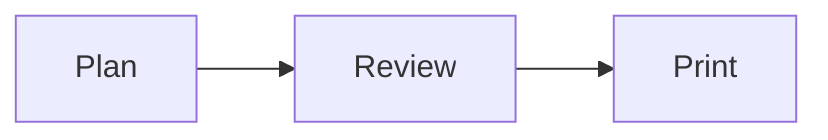

+++
title = "Browser smoke plan"
purpose = "Print coverage"
+++

# Browser smoke plan

This fixture verifies airplan's rendered-page browser behavior.

<details id="print-disclosure">
<summary>Collapsed details</summary>
<p>Print must include this disclosure content.</p>
<div hidden data-print-hidden>Hidden disclosure content.</div>
<script type="application/json" data-print-script>{"hidden":true}</script>
<style data-print-style>.print-hidden-fixture { color: red; }</style>
</details>

<details id="print-open-disclosure" open>
<summary>Expanded details</summary>
<p>Print must preserve this disclosure's expanded state.</p>
</details>

## Overview

The generated page should work independently of developer config.

## Details

- Rendered and source views remain accessible.
- Copy controls preserve exact source and code bytes.

## Code sample

```js
const answer = 42;
console.log(answer);
```

## Diagram



## Final checks

The compact table of contents remains available after the inline navigation
scrolls out of view on a narrow screen.
